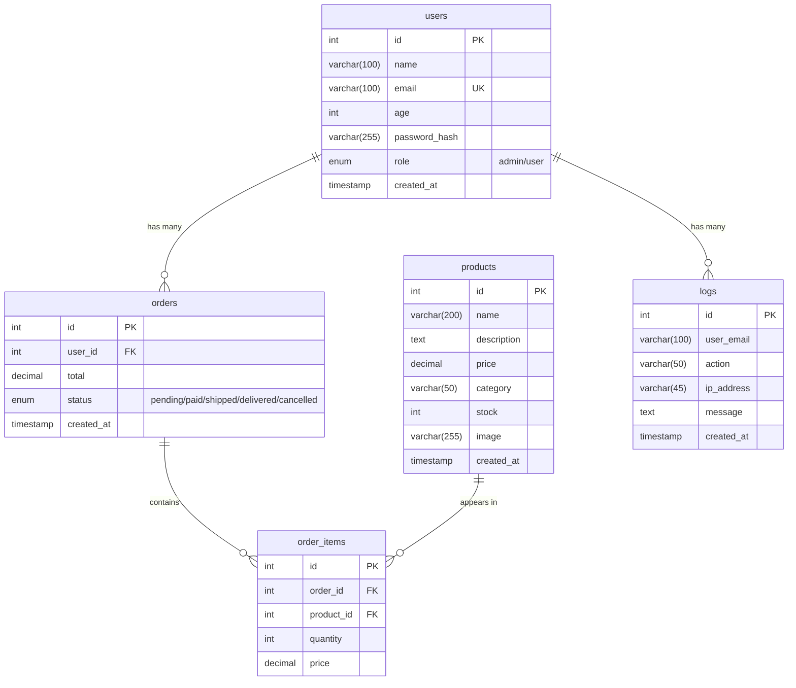

## Схема базы данных

### Структура таблиц



### Схема связей между таблицами

```
┌─────────────────────────────────────────────────────────────────────────────┐
│                                   users                                     │
│  ┌─────────────────────────────────────────────────────────────────────┐   │
│  │ id (PK) │ name │ email (UK) │ password_hash │ role │ created_at    │   │
│  └─────────────────────────────────────────────────────────────────────┘   │
│                                    │                                        │
│              ┌─────────────────────┼─────────────────────┐                  │
│              │                     │                     │                  │
│              ▼                     ▼                     ▼                  │
│  ┌───────────────────┐   ┌───────────────────┐   ┌───────────────────┐     │
│  │      orders       │   │       logs        │   │  (корзина в       │     │
│  ├───────────────────┤   ├───────────────────┤   │   localStorage)   │     │
│  │ id (PK)           │   │ id (PK)           │   │                   │     │
│  │ user_id (FK) ─────┼───│ user_email        │   │  Хранится на      │     │
│  │ total             │   │ action            │   │  стороне клиента  │     │
│  │ status            │   │ ip_address        │   │                   │     │
│  │ created_at        │   │ message           │   └───────────────────┘     │
│  └─────────┬─────────┘   │ created_at        │                             │
│            │             └───────────────────┘                             │
│            │                                                               │
│            │ 1                                                             │
│            ▼                                                               │
│  ┌─────────────────────────────────────────────────────────────────────┐   │
│  │                           order_items                               │   │
│  │  ┌─────────────────────────────────────────────────────────────┐   │   │
│  │  │ id (PK) │ order_id (FK) │ product_id (FK) │ quantity │ price │   │   │
│  │  └─────────────────────────────────────────────────────────────┘   │   │
│  └─────────────────────────────────────────────────────────────────────┘   │
│                                    │                                        │
│                                    │                                        │
│                                    ▼                                        │
│  ┌─────────────────────────────────────────────────────────────────────┐   │
│  │                            products                                 │   │
│  │  ┌─────────────────────────────────────────────────────────────┐   │   │
│  │  │ id (PK) │ name │ description │ price │ category │ stock │ image │   │
│  │  └─────────────────────────────────────────────────────────────┘   │   │
│  └─────────────────────────────────────────────────────────────────────┘   │
└─────────────────────────────────────────────────────────────────────────────┘
```

### Описание таблиц

| Таблица | Описание | Поля |
|---------|----------|------|
| **users** | Пользователи системы | id, name, email, age, password_hash, role, created_at |
| **products** | Товары (велосипеды) | id, name, description, price, category, stock, image, created_at |
| **orders** | Заказы | id, user_id, total, status, created_at |
| **order_items** | Позиции заказов | id, order_id, product_id, quantity, price |
| **logs** | Логи авторизации | id, user_email, action, ip_address, message, created_at |

### Типы связей

| Связь | Тип | Описание |
|-------|-----|----------|
| users → orders | 1 : N | Один пользователь может оформить много заказов |
| users → logs | 1 : N | Один пользователь может иметь много записей в логах |
| orders → order_items | 1 : N | Один заказ может содержать много позиций |
| products → order_items | 1 : N | Один товар может быть во многих заказах |

### Примечание

Корзина покупок (`cart`) отсутствует в базе данных, так как реализована на клиентской стороне с использованием `localStorage` браузера. Это позволяет:
- Сохранять товары при перезагрузке страницы
- Работать без постоянных запросов к серверу
- Обеспечить быстродействие интерфейса
