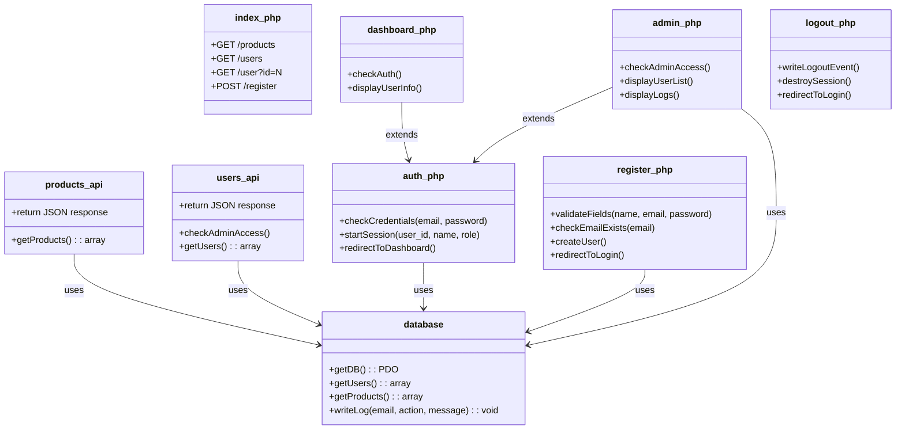

```mermaid
classDiagram
    class index_php {
        +GET /products
        +GET /users
        +GET /user?id=N
        +POST /register
    }
    
    class products_api {
        +getProducts() : array
        +return JSON response
    }
    
    class users_api {
        +checkAdminAccess()
        +getUsers() : array
        +return JSON response
    }
    
    class database {
        +getDB() : PDO
        +getUsers() : array
        +getProducts() : array
        +writeLog(email, action, message) : void
    }
    
    class auth_php {
        +checkCredentials(email, password)
        +startSession(user_id, name, role)
        +redirectToDashboard()
    }
    
    class dashboard_php {
        +checkAuth()
        +displayUserInfo()
    }
    
    class admin_php {
        +checkAdminAccess()
        +displayUserList()
        +displayLogs()
    }
    
    class register_php {
        +validateFields(name, email, password)
        +checkEmailExists(email)
        +createUser()
        +redirectToLogin()
    }
    
    class logout_php {
        +writeLogoutEvent()
        +destroySession()
        +redirectToLogin()
    }
    
    products_api --> database : uses
    users_api --> database : uses
    auth_php --> database : uses
    register_php --> database : uses
    admin_php --> database : uses
    
    dashboard_php --> auth_php : extends
    admin_php --> auth_php : extends
```
