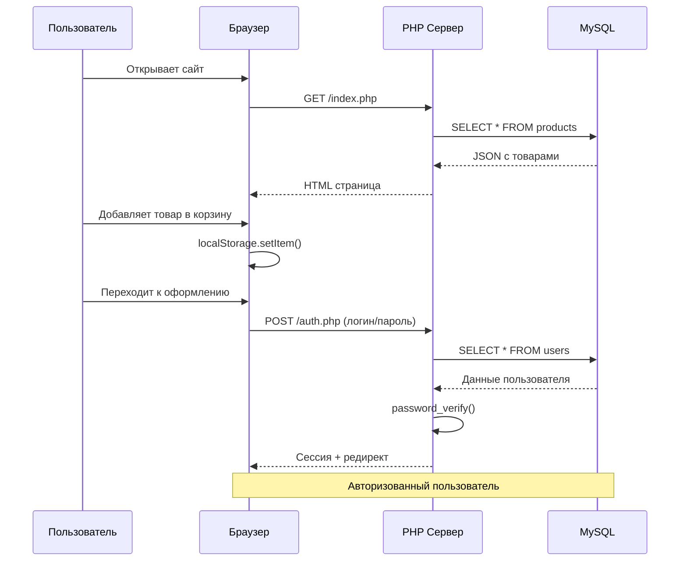

## Архитектура клиент-серверного приложения

```mermaid
flowchart TB
    subgraph Клиент[ КЛИЕНТСКАЯ ЧАСТЬ]
        Browser[ Браузер пользователя]
        HTML[ HTML/CSS/JS]
        React[ React виджеты]
        Storage[ localStorage корзина]
    end
    
    subgraph Сервер[ СЕРВЕРНАЯ ЧАСТЬ]
        Apache[ Apache Web Server]
        API[ REST API<br>/api/products.php<br>/api/users.php]
        Auth[ Авторизация<br>login.php / auth.php]
        Session[ Сессии PHP]
    end
    
    subgraph Данные[ ХРАНЕНИЕ ДАННЫХ]
        MySQL[( MySQL<br>users / products / cart)]
        Logs[ Логи авторизации<br>logs/auth.log]
    end
    
    Browser -->|HTTP запрос| Apache
    Apache -->|Вызов| API
    Apache -->|Вызов| Auth
    Auth -->|Создание| Session
    
    API -->|PDO запрос| MySQL
    Auth -->|PDO запрос| MySQL
    
    MySQL -->|JSON ответ| API
    MySQL -->|Данные пользователя| Auth
    
    API -->|JSON| Browser
    Auth -->|Редирект/HTML| Browser
    
    Browser <-->|Чтение/запись| Storage
    
    Auth -.->|writeLog()| Logs
```

### Описание компонентов

| Компонент | Технология | Назначение |
|-----------|------------|------------|
| **Клиентская часть** | HTML, CSS, JS, React | Отображение интерфейса, корзина в localStorage |
| **Веб-сервер** | Apache 2.4 | Обработка HTTP-запросов |
| **REST API** | PHP 8 | GET /products, GET /users, POST /register |
| **Авторизация** | PHP + Сессии | Вход, регистрация, разграничение ролей |
| **База данных** | MySQL 8 | Хранение пользователей, товаров, корзины |
| **Логирование** | Файловая система | Запись событий входа/выхода |

### Схема взаимодействия


